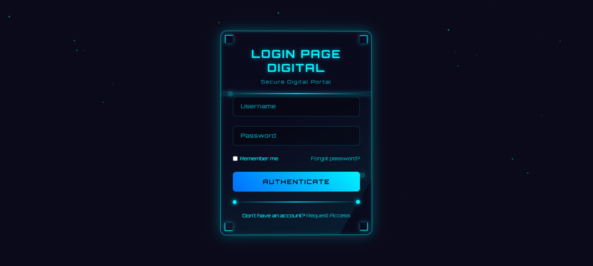

# 🌐 QuantumGate 3D Login Portal

 

## 🚀 Live Demo
(https://3dlogin-page.netlify.app/))<!-- Add your live demo link here -->

> A futuristic 3D animated login interface with cyberpunk aesthetics and particle effects

## ✨ Features

- **Immersive 3D Effects**
  - Parallax tilt on mouse movement
  - Floating container animation
  - Depth-preserving transforms

- **Dynamic Visuals**
  - Animated particle background (100+ particles)
  - Scanning beam authentication effect
  - Pulsing corner nodes

- **Modern UI Elements**
  - Floating form labels
  - Gradient authentication button
  - Glowing input fields
  - Digital separator with endpoint nodes

- **Responsive Design**
  - Adapts to all screen sizes
  - Mobile-friendly interactions
  - Consistent theming across devices

## 🛠 Technologies Used

| Category        | Technologies                          |
|-----------------|---------------------------------------|
| Core            |    |
| Animations      |   |
| Visual Effects  |   |

## 🚀 Getting Started

### Prerequisites
- Modern browser (Chrome, Firefox, Edge latest versions)
- Hardware acceleration enabled

### Installation
1. Clone the repository:
```bash
git clone https://github.com/harshith1476/quantum-login.git

🎨 Design Specifications
Element	Properties
Color Palette	Primary: #00f3ff, Background: #0a0a1a
Typography	Orbitron (Google Fonts)
Container	380px width, glassmorphism effect
Particles	Random sizes (1-4px), 15s animation
📂 File Structure
text
quantum-login/
├── index.html          # Main application file + css - # For external CSS + js - # For external JS
├── README.md           # Documentation
🌍 Browser Support
Browser	Support
Chrome	✅ 100%
Firefox	✅ 100%
Safari	✅ 95%
Edge	✅ 100%
📜 License
MIT © Vemula Harshith

📬 Contact
Email: vemulaharshith1476@gmail.com

GitHub: @harshith1476

LinkedIn: Harshith Vemula
